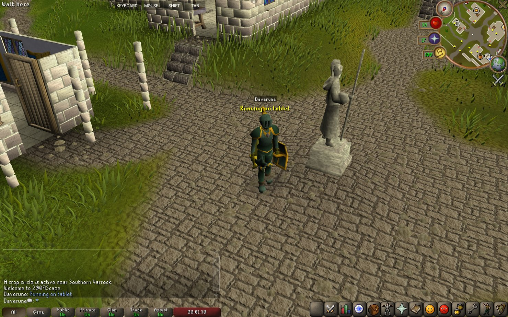
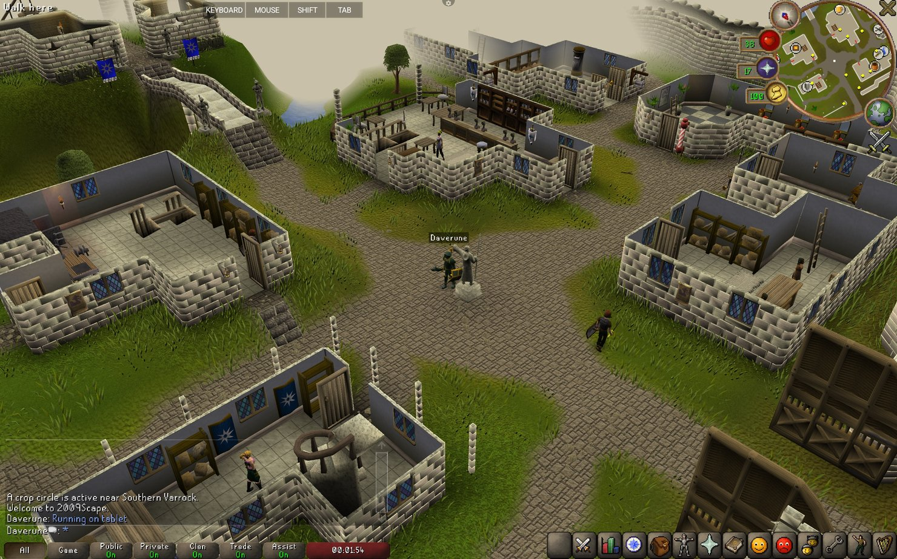
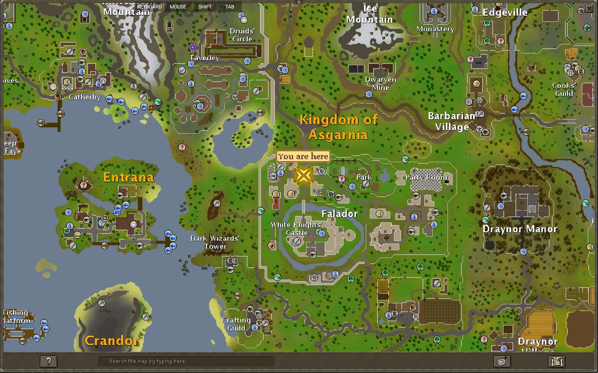

<h1 align="center">2009Scape Mobile - DaveRune's Fork</h1>

## A mobile app to play a more recent 2009Scape with bug fixes.

<p align="center">
  
</p>
<p align="center">
  
</p>
<p align="center">
  
</p>

## What this is?

An unofficial fork of [2009scape/2009Scape-mobile](https://github.com/2009scape/2009Scape-mobile), which is itself an unofficial Android app for playing 2009Scape, built on PojavLauncher.

I built this for me. I wanted to play 2009Scape on my tablet, I found the existing app had been sitting untouched since 2024, and fixed the things that were stopping me enjoying it. It works well enough now that it seemed worth sharing.

I am not committing to maintaining it, supporting it, or taking requests. There is no roadmap and there are no promises. If it is useful to you, please use it and I hope you enjoy it too.

I used AI.

## Added

| | |
|---|---|
| Interface scale | The world renders at your device's full resolution while the interface is drawn larger, so nothing is soft and nothing is too small to tap. Slider in Settings. |
| View distance | Stock is 28 tiles, this defaults to 48 and goes to 51. Use command `::vd #` in game and relog.|
| Up to date client | The client is rebuilt from source with two years of upstream desktop fixes merged in, including a sleep in the game loop, roof hiding and correct chat icons. |
| Camera controls | Pan sensitivity and invert Y, both in Control customization. |
| Pinch zoom | With its own sensitivity slider. |
| Nameplates | Craftify ships with the app. |

## Fixed

| | |
|---|---|
| Touch accuracy | Now accurate and not offset slightly. If you run in any kind of windowed mode and resize, it'll need a restart. |
| Stylus / s-pen | The pen moved the cursor but never clicked. Now supports left and right click. |
| World map | It draws properly now. Currenty needs a stylus to pan, pich zoom works but is janky. |
| Sound effects and ambient | They now both play. They may stop after a long play session. |
| Music | Doesn't stop any more... at least not for a long time, might be fully fixed. |
| Background audio | The game kept playing with the app minimised or the screen off, not any more. |
| Camera controls | Improved gesture regognition for pan and pinch to zoom. |
| Launcher buttons | The HD and SD hitboxes did not line up with the artwork on most screens. |
| Header bar | Now positioned correctly |
| Settings | Previously no way out of the screen, and the back button crashed on sub-pages. |

## Known and not fixed

The camera turns in visible steps of about 2.6 degrees rather than smoothly. The world map cannot be panned or zoomed by finger, only by pen. Battery use might still be high.

## Install

Grab the APK from [Releases](https://github.com/DaveRune/2009Scape-mobile/releases) and install it. Android will warn you about installing outside the Play Store, which is expected.

## Build

Needs the Android SDK with platform 33, build tools 33.0.2 and NDK 25.2.9519653, and a JDK 17.

```bash
./gradlew :app_pojavlauncher:assembleDebug
```

## Where everything comes from

| Part | Source |
|---|---|
| This app | Forked from [2009scape/2009Scape-mobile](https://github.com/2009scape/2009Scape-mobile), which is based on PojavLauncher |
| The game client | [DaveRune/rt4-client](https://github.com/DaveRune/rt4-client), forked from [downthecrop/rt4-client](https://gitlab.com/downthecrop/rt4-client) |
| The desktop client | [2009scape/rt4-client](https://gitlab.com/2009scape/rt4-client) |
| The server | 2009Scape, which I have nothing to do with |

Licensed GPL-3.0, same as the project it came from. See [LICENSE](LICENSE).
